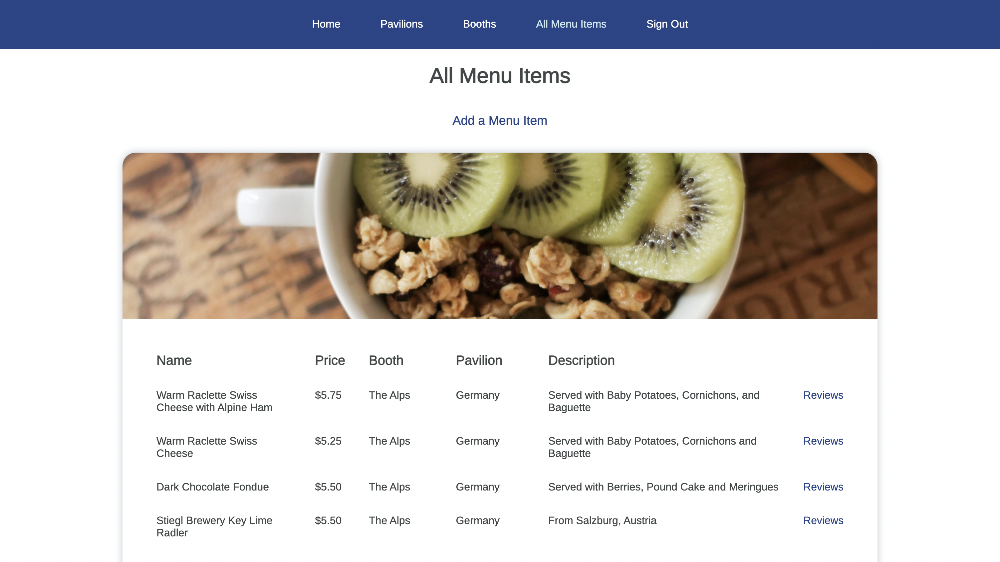

# Food & Wine Festival Reviewer - Full-stack CRUD Application

## App Description

A user-friendly full-stack CRUD application designed to help Food & Wine Festival attendees navigate and explore the event's menu offerings. Users can view menu items at the festival by pavilion (general vicinity), booth (specific location), or by browsing the entire catalog of menu items available. Additionally, users can read reviews for each of the festival menu items, as well as create and delete their own reviews.

## App Screenshots

## Technologies Used

    ☐ JavaScript
    ☐ HTML
    ☐ CSS
    ☐ Mongoose
    ☐ MongoDB
    ☐ Express
    ☐ Node.js
    ☐ EJS

## Getting Started

[Heroku](https://festival-app-10083f0901ad.herokuapp.com/)
[Trello Board](https://trello.com/invite/b/bvtbEv0E/ATTIb475f8d839d66962d65f09d0217797a793724F04/sei-project-2-food-wine-festival-app)

## Next Steps

    ☐ Creating a checklist page, so that users can keep track of menu items they've tried/want to try
    ☐ Adding a "Best of the Fest" page that ranks the top 10 menu items based on average user ratings.
